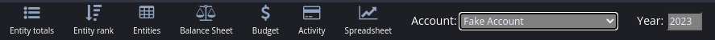
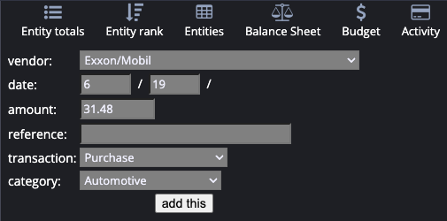
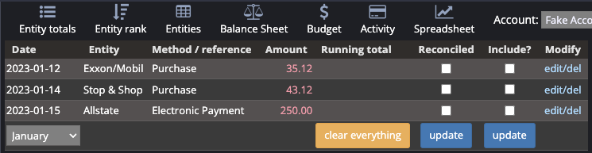
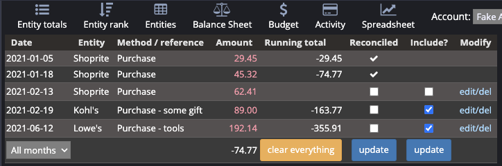
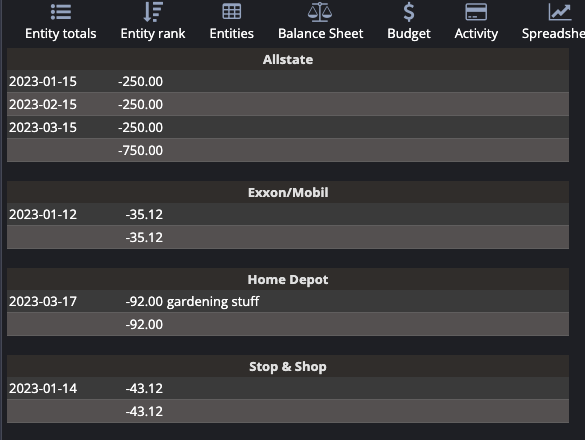
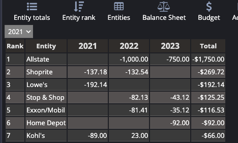
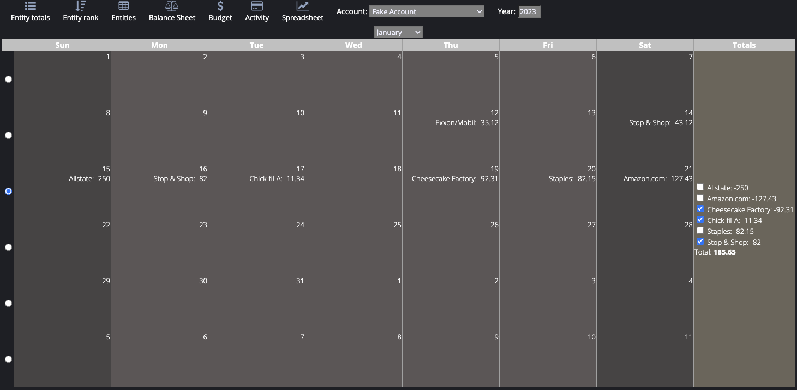
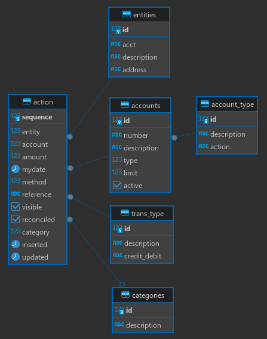

### Finances

Originally a PHP application, the financial management system allows
you to track transactions for an arbitrary number of accounts. The
purpose of this application is to perform data analytics over periods of
time to make intelligent spending and saving decisions. This will
aide in budgeting and financial planning.

Given the long history of the application, there may be some legacy
code that needs updating to modern standards.

---
### Requirements

- **Java 25**: Since this is a Java 25 application, it will require JDK 25 or later.
- **Gradle**: Gradle 9 is required to perform builds. A `gradlew` wrapper is included
  for convenience. Building the image (e.g. `podman build . -t localhost/finances:x.y.z`)
  will automatically retrieve the appropriate builder during phase 1 of the build.
- **Redis**: The application uses Redis to persist session information, allowing
  the application scale horizontally without encountering session affinity problems.
  When deployed to Kubernetes, a Redis pod is created as part of the deployment
  and leveraged during use of the application. In a development environment,
  a Redis instance will be necessary independent of Kubernetes.
- **PostGreSQL**: The data are persisted to PostGreSQL. While it may be plausible
  to use a different database, there may be PostGreSQL-specific syntax in some
  queries.

The application can run on a local system or in a container (e.g.: Docker,
Kubernetes).

---
### The Interface

The navigation bar common to all pages is:



From left to right:

- **Entity Totals** (see [Reports](#reports) below)
- **Entity Rank** (see [Reports](#reports) below)
- **Entities**: these are merchants, payees, or any method of expense (e.g.: vending machine) or income. Entities are maintained on this page.
- **Balance Sheet**: not in the sense of accounting; these are balances at the end of each month, demonstrating a profit or deficit
- **Budget** (see "Monthly" in [Reports](#reports) below)
- **Activity**: how all activity is entered
- **Spreadsheet**: a monthly or annual spreadsheet-like view

At present, there is no automatic import from bank statements. The `Activity` button presents an interface to enter any activity. The year must be specified in the navigation bar:



The `Spreadsheet` button provides a non-configurable spreadsheet whereby one can select to `Include` figures in the running total, and once satisfied, make the entry permanent (uneditable) by selecting `Reconciled`:



Instead of selecting a single month, for accounts where there is limited acitivity, `All Months` can be selected in the spreadsheet:



Here we see some reconciled entries, some included, and the total at the bottom reflects only the reconciled. Anything that's been reconciled is automatically considered included, and the includes reflect a running  total regardless of what has been reconciled. If an entry is neither included nor reconciled, it is not considered in any total.

---
### Reports

There are currently 4 reports: 
- *Entity Totals*: displays all transactions for a given account and
year, grouped and totaled by entity.



- *Entity Rank*: lists each entity's total by year and ranks entities
by the amount. A drop-down with a list of available years is rendered, and this is what determines from what year to start the comparisons and totals.




- *Monthly*: summarizes an account's deposits and withdrawals (any type
of expense) by month for the selected year. Select a radio box on the left (one per week) and all those transactions will show up by entity on the right. Select the checkboxes for the desired entities to see how much was spent for a given week on a particular entity. This is useful for budgeting, where you may want to total all food-related entities for a week.



An entity is defined as anything or anyone who was paid (destination)
or who provided income (source), even via refund.

---
### Database requirements

The application authenticates against the database, so the following extension must be enabled:

CREATE EXTENSION pgcrypto;

There is an RBAC schema which presently only containst a flat file, but it will be enhanced to contain true roles with read or read/write access to specific accounts.

The public schema contains the following tables whose names should be self-explanatory:



Some table and field name refactoring has already been done. Future releases will rename certain fields that are identifiers in PostGreSQL (e.g.: "sequence").

---
#### Build instructions

The standard gradle commands are used to build the app:

```shell
gradle clean build
```

You can also use the `gradlew` wrapper.

To prepare a deployment image:

```shell
podman build . -t localhost/finances:x.y.z
```

Ensure the image release name matches in `Dockerfile` and `helm/values.yaml`.

---
### Running the app

Three environment variables are required, and can be specified individually
or as a JSON string:

```shell
export SPRING_APPLICATION_JSON='
{
  "spring":{
    "datasource":{
      "username":"someuser",
      "password":"somepassword",
      "url":"jdbc:postgresql://my-database:5432/finances"
    }
  }
}
'

version=$(grep ^version build.gradle | awk '{print $3}' | tr -d "'")
java -Dspring.profiles.active=uat -jar build/libs/finances-${version}.jar
```

# Future Enhancements

- [ ] True RBAC
- [x] Disable account after 3 failed login attempts (v 3.10.0)
- [ ] Import bank statements:
- - [ ] Read PDF
- - [ ] Consult Ollama Mistral LLM for vendor matching
- - [ ] Create transactions
