# Finances

Originally a PHP application, the financial management system allows
you to track transactions for an arbitrary number of accounts. The
purpose of this application is to perform data analytics over periods of
time to make intelligent spending and saving decisions. This will
aide in budgeting and financial planning.

Given the long history of the application, there may be some legacy
code that needs updating to modern standards.

---
## Requirements

- **Java 25**: JDK 25 or later is required
- **Gradle**: Gradle 9
- **Redis**: The application uses Redis to persist session information, allowing
  the application scale horizontally without encountering session affinity problems.
  When deployed to Kubernetes, a Redis pod is created as part of the deployment
  and leveraged during use of the application. In a development environment,
  a Redis instance will be necessary independent of Kubernetes.
- **PostGreSQL**: The data are persisted to PostGreSQL. While it may be plausible
  to use a different database, there may be PostGreSQL-specific syntax in some
  queries.

The application can run on a local system or in a container (e.g.: Docker,
Kubernetes).

---
## The Interface

The navigation bar common to all pages is:

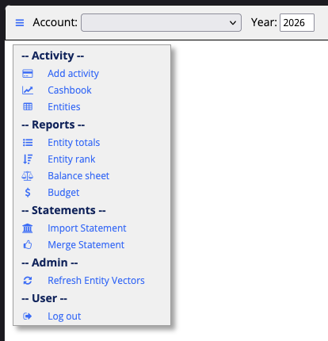

The `Add activity` selection presents an interface to enter any activity. The year and account must be specified in the navigation bar:

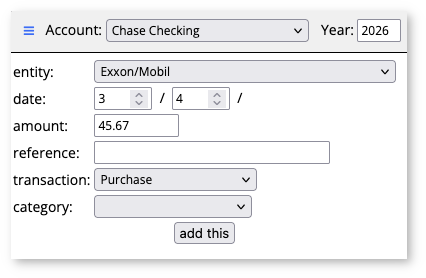

The `Spreadsheet` button provides a non-configurable spreadsheet whereby one can select to `Include` figures in the running total, and once satisfied, make the entry permanent (uneditable) by selecting `Reconciled`:

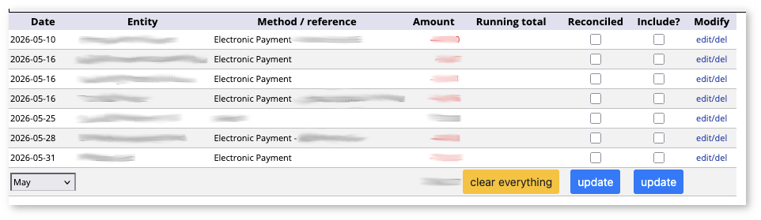

Instead of selecting a single month, for accounts where there is limited acitivity, `All Months` can be selected in the spreadsheet:

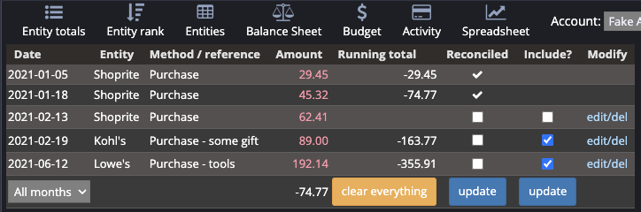

Here we see some reconciled entries, some included, and the total at the bottom reflects only the reconciled. Anything that's been reconciled is automatically considered included, and the includes reflect a running  total regardless of what has been reconciled. If an entry is neither included nor reconciled, it is not considered in any total.

---
## Reports

There are currently 4 reports:
- *Entity Totals*: displays all transactions for a given account and
year, grouped and totaled by entity.

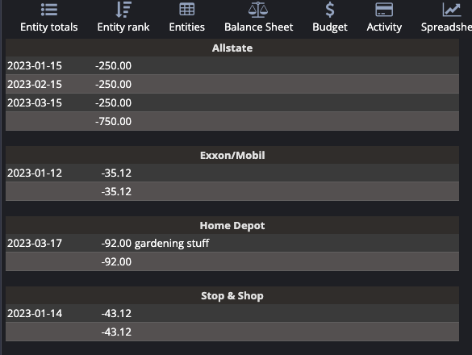

- *Entity Rank*: lists each entity's total by year and ranks entities
by the amount. A drop-down with a list of available years is rendered, and this is what determines from what year to start the comparisons and totals.

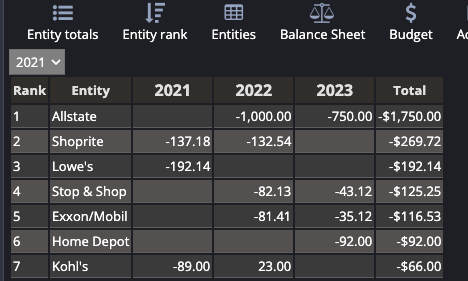


- *Monthly*: summarizes an account's deposits and withdrawals (any type
of expense) by month for the selected year. Select a radio box on the left (one per week) and all those transactions will show up by entity on the right. Select the checkboxes for the desired entities to see how much was spent for a given week on a particular entity. This is useful for budgeting, where you may want to total all food-related entities for a week.

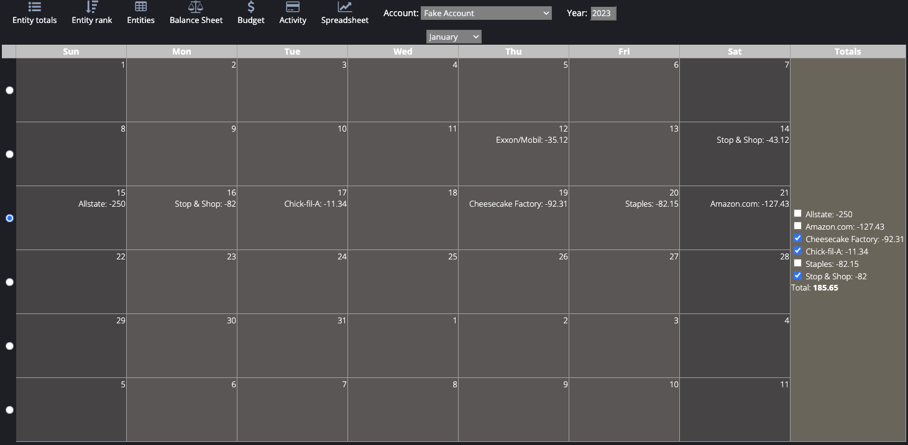

An entity is defined as anything or anyone who was paid (destination)
or who provided income (source), even via refund.

---
## Statement Import / Merge

By far, one of the most useful features of the application is the ability to import bank statements rather than
manually entering transactions. The AI agent contains logic that understands how to parse specific bank statements,
and the data is returned in a structured format.

The vendor for each transaction attempts to be matched to the database vendors using vector embeddings. If the
confidence score is below 75%, it is sent to the LLM for further evaluation. The LLM is provided with tools to
consult the database. The results are persisted in a staging table, whereby human reviewers can verify and approve the
matches. The reviewer can opt for the vector match, the LLM, or changing the LLM suggestion to an existing vendor.

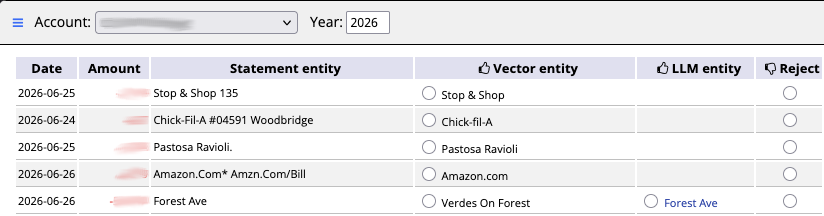

### Vector Calculations

An entity is considered “valid” when it has a corresponding vector list. Entities which the LLM creates that are accepted by the user via the Statement Merge UI do not automatically have their vectors generated; the user must manually generate the vectors for the entity. Two icons are presented for unvalidated entities in the Entities UI: Delete and Validate. Delete immediately deletes from the entities table, which Validate publishes a message so that the agent calculates the vector. This app does not have dependencies to manage vectors; only the agent does.

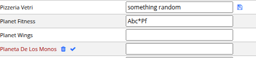

### RAG maintenance

Entities can appear on statements as very cryptic strings. Take the example of Planet Fitness: on a Chase statement, it can appear as “Abc*Pf”. This means that neither the embedded vectors for Planet Fitness nor the LLM will perform a reliable match. A RAG field has been provided that contains any other additional text that can lead to high confidence scores.

The UI allows for establishing and editing these RAG values. They are concatenated with the entity name, and the vector is then calculated.

There is a require for atomicity of this operation: we must save the data and then publish a message to have the vector calculated, and there is no guarantee the message will be delivered. The solution is a reconciliation process. The entities table has timestamp fields and triggers to that automatically reflect when data is saved and can be compared to determine if a save was done without a complementary recalculate.

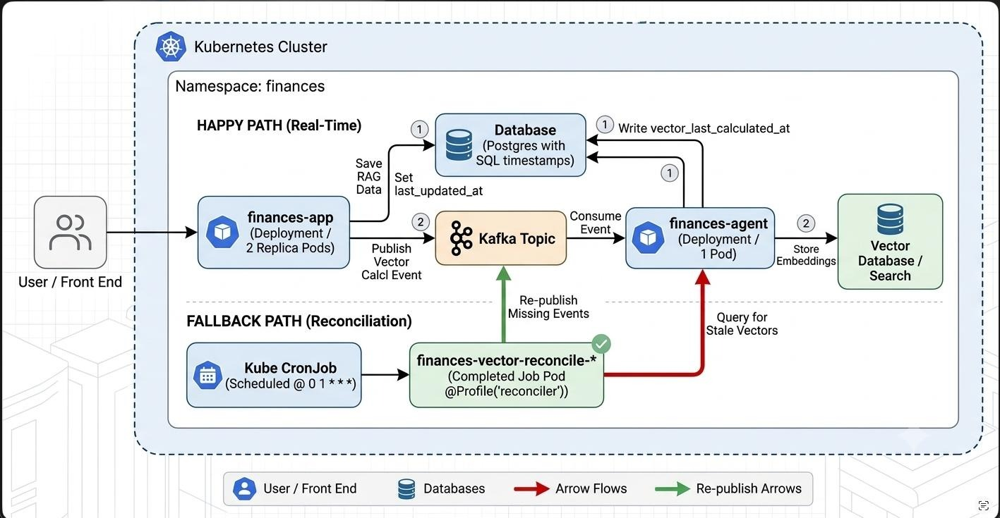

---
## Database requirements

The application authenticates against the database, so the following extension must be enabled:

CREATE EXTENSION pgcrypto;

There is an RBAC schema which presently only containst a flat file, but it will be enhanced to contain true roles with read or read/write access to specific accounts.

The public schema contains the following tables whose names should be self-explanatory:

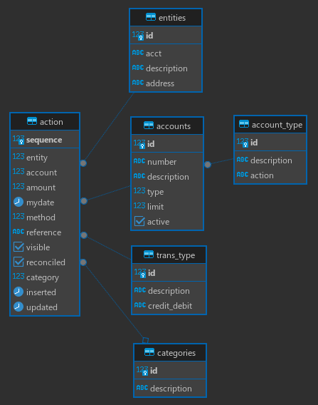

Some table and field name refactoring has already been done. Future releases will rename certain fields that are identifiers in PostGreSQL (e.g.: "sequence").

### RBAC Schema

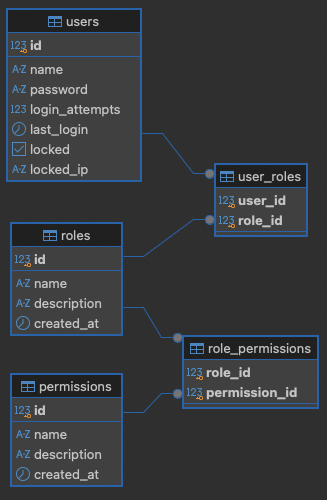


---
#### Build instructions

The standard gradle commands are used to build the app:

```shell
gradle clean build
```

You can also use the `gradlew` wrapper.

To prepare a deployment image:

```shell
podman build . -t registry:5000/finances:x.y.z
```

Ensure the image release name matches in `Dockerfile` and `helm/values.yaml`.

---
### Running the app

Three environment variables are required, and can be specified individually
or as a JSON string:

```shell
export SPRING_APPLICATION_JSON='
{
  "spring":{
    "datasource":{
      "username":"someuser",
      "password":"somepassword",
      "url":"jdbc:postgresql://my-database:5432/finances"
    }
  }
}
'

version=$(grep ^version build.gradle | awk '{print $3}' | tr -d "'")
java -Dspring.profiles.active=uat -jar build/libs/finances-${version}.jar
```
